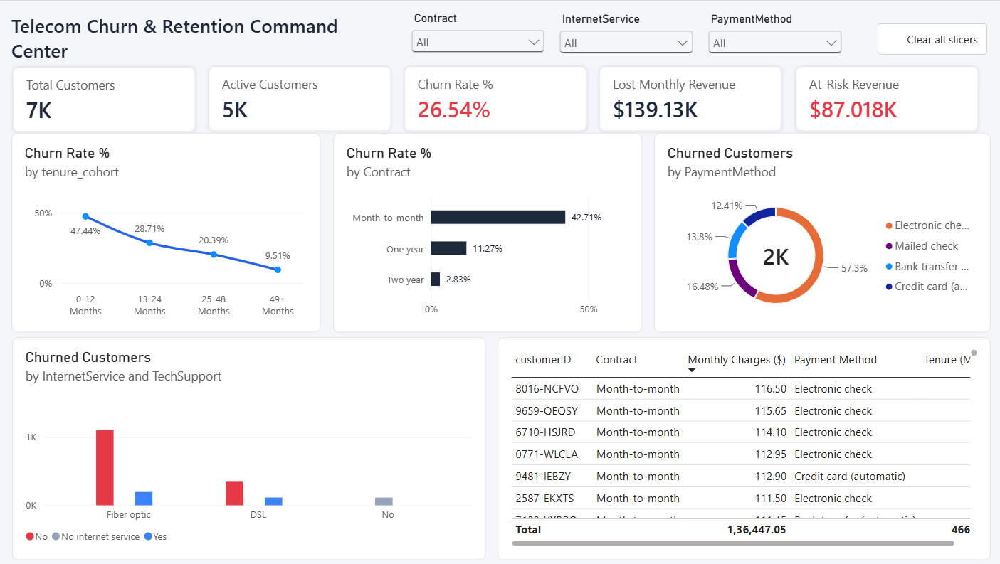
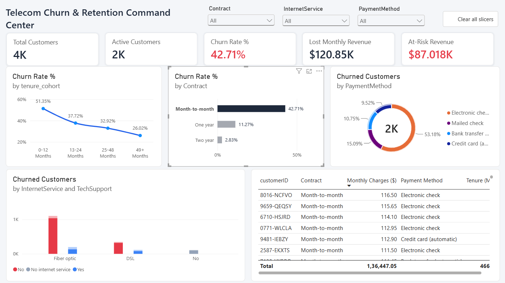

# 📊 Telecom Customer Churn & Retention Command Center

An end-to-end data analytics and business intelligence project identifying key drivers of customer attrition, evaluating customer lifecycle retention windows, and quantifying monthly recurring revenue risk across 7,043 telecommunication accounts.

---

## 📌 Executive Dashboard Overview

| Baseline Portfolio Overview | Month-to-Month High-Risk Cohort |
| :---: | :---: |
|  |  |

---

## 🚀 Key Business Findings & Metrics

* **Revenue at Risk Quantified:** Isolated **$139.13K** in lost monthly recurring revenue (MRR), identifying that month-to-month subscriptions contribute over **86.8% ($120.85K)** of all lost revenue.
* **Proactive At-Risk Pool:** Identified an active, high-spend pool of **$87.02K/month (~$1.04M ARR)** tied to active month-to-month accounts spending $\ge$ $70/month.
* **The 12-Month Retention Cliff:** Attrition peaks heavily at **47.44%** during the initial `0–12 Months` cohort (surpassing **51.35%** for month-to-month contracts) before declining to **9.51%** past 48 months.
* **Payment Friction:** Accounts paying via **Electronic Check** represent **57.3%** of all churned subscribers.
* **Service Vulnerability:** Fiber Optic subscribers lacking dedicated **Tech Support** form the single largest cancellation cluster across the entire enterprise (>1,100 churned accounts).

---

## 🛠️ Tech Stack & Workflow

* **Python (Pandas, NumPy, Scikit-Learn):** Data cleaning, missing value imputation, typecasting, feature engineering (`tenure_cohort`, `is_high_risk`, `churn_numeric`), and correlation analysis.
* **SQL (MySQL):** Database schema modeling, aggregations, window functions (`NTILE` spend quartiles), and multi-variable cross-cohort queries.
* **Power BI:** Star-schema analytical data modeling, dynamic DAX measures (`[Churn Rate %]`, `[Lost Monthly Revenue]`, `[At-Risk Revenue]`), custom canvas UI containers, and interactive cross-filtering.

---

## 🧮 Core DAX Measures

```dax
// Total churn percentage
Churn Rate % = 
DIVIDE([Churned Customers], [Total Customers], 0)

// Total lost monthly recurring revenue
Lost Monthly Revenue = 
CALCULATE(
    SUM('cleaned_churn_data'[MonthlyCharges]),
    'cleaned_churn_data'[Churn] = "Yes"
)

// Active high-spending accounts on Month-to-Month plans
At-Risk Revenue = 
CALCULATE(
    SUM('cleaned_churn_data'[MonthlyCharges]),
    'cleaned_churn_data'[Churn] = "No",
    'cleaned_churn_data'[Contract] = "Month-to-month",
    'cleaned_churn_data'[MonthlyCharges] >= 70
)
---

## 💡 Strategic Business Recommendations

1. **Incentivize Annual Migration:**
   * **Finding:** Month-to-Month churn sits at 42.71% vs. 11.27% for 1-year commitments.
   * **Action:** Launch a targeted campaign offering a 10%–15% incentive credit to convert month-to-month accounts to annual billing.
   * **Impact:** Converting 25% of eligible accounts protects ~$21.7K in recurring monthly revenue.

2. **Revamp Days 0–90 Onboarding:**
   * **Finding:** Nearly half (47.44%) of all customer churn happens during the first year of tenure.
   * **Action:** Institute structured milestone check-ins at 30, 60, and 90 days with dedicated onboarding support agents.

3. **Bundle Complimentary Tech Support:**
   * **Finding:** Fiber Optic accounts without Tech Support experience catastrophic attrition compared to supported peers.
   * **Action:** Provide 3 months of complimentary technical support with all new Fiber Optic activations to improve early adoption.

---

## 📂 Repository Structure

```text
telecom-churn-retention-analysis/
├── data/
│   ├── raw/                  # Raw Telco dataset
│   └── processed/            # Cleaned data with engineered features
├── notebooks/
│   ├── 01_data_cleaning.ipynb
│   └── 02_eda_and_insights.ipynb
├── sql/
│   ├── 01_schema_setup.sql
│   └── 02_churn_cohort_queries.sql
├── powerbi/
│   └── telecom_churn_dashboard.pbix
└── screenshots/              # High-resolution dashboard previews
